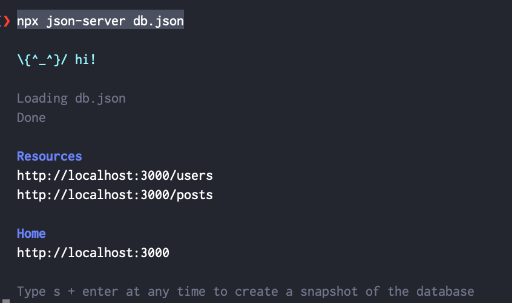
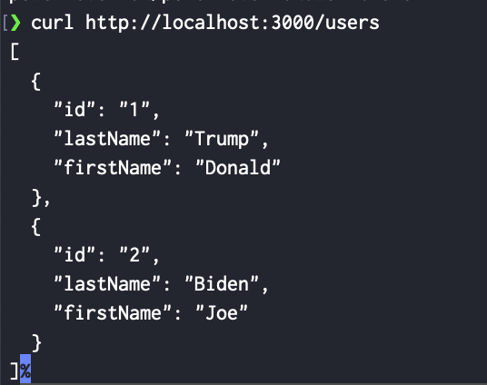

# json-server


## Description

JSON Server is a node package that helps you to expose a REST API from a JSON file

## Installation

```bash
npm install json-server
```

### Creation of a sample JSON file

Let's create a **db.json** file as follow:

```json
{
  "users": [
    { "id": "1",
      "lastName": "Trump",
      "firstName": "Donald"
    },
    {
      "id": "2",
      "lastName": "Biden",
      "firstName": "Joe"
    }
  ],
  "posts": [
    { "id": 1,
      "authorId": "1",
      "title": "Quote of the day",
      "content": "A great day for America"
    }
  ]
}
```

### Start the json-server

We use the **npx** to start a JSON Server

```bash
npx json-server db.json
```

#### Result



#### Test the json server

Let's use **curl** tool to test the API

```bash
curl http://localhost:3000/users
```

